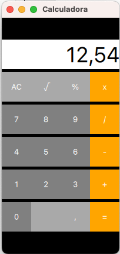

# qtProjects
About free time Qt projects done.
## Second project

## Calculator with Javascript
Second project made with QtQuick module and its own objects. In this project some kind of buttons have been made and then they has been inserted to the code with a calculator engine made in JavaScript now in progress.
## First project

## Rectangles and functions
First project with qt Creator to learn qml, it is made up of several that change color if you click on the corresponding text and a counter that increases or decreases a value depending on the clicked rectangle.
