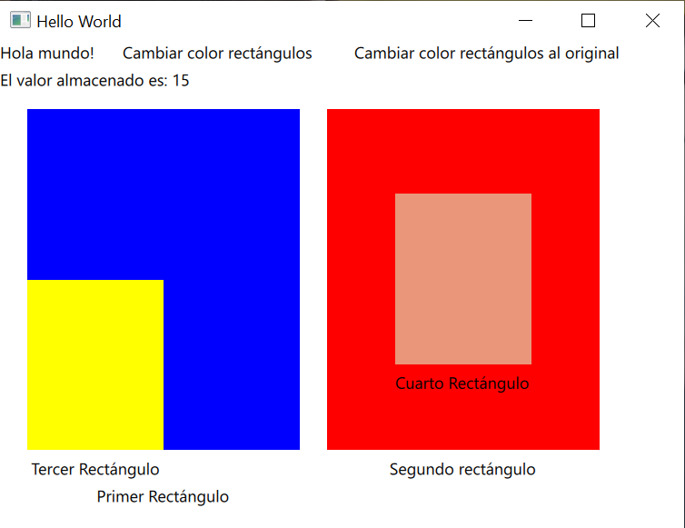

# qtProjects
About free time Qt projects done.
## First project

## Rectangles and functions
First project with qt Creator to learn qml, it is made up of several that change color if you click on the corresponding text and a counter that increases or decreases a value depending on the clicked rectangle.
